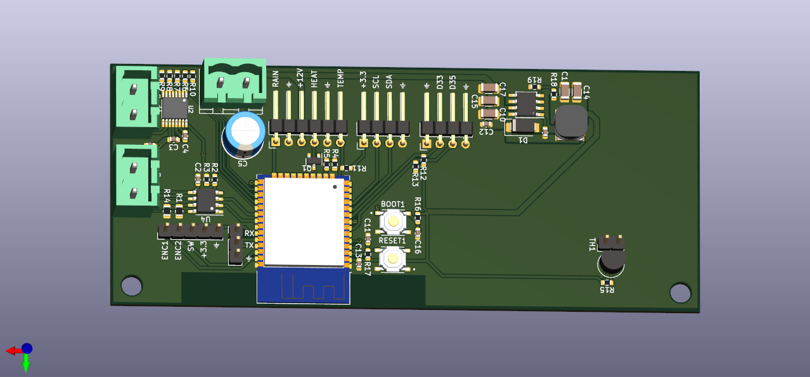

# OpentasticFan
OpentasticFan is a replacement for the factory control board found in most Fantastic Fans. It should also be possible to upgrade a basic Fantastic Fan that does not have rain sensing or power opening with the addition of a [Fantastic Fan lift motor assembly](https://www.etrailer.com/Accessories-and-Parts/Fantastic-Vent/FVK6010-80.html).

It supports:
- Cover Opening and Closing
- Rain Sensing
- Fan Speed Control 
- OLED Display and Rotary Encoder for local control
- Remote control via [Home Assistant](https://www.home-assistant.io/)

## Hardware

- [SH1106 128x64 i2c OLED Display](https://www.amazon.ca/dp/B085RYPHT2)
- [Rotary Encoder with button](https://www.amazon.ca/WayinTop-Degree-Encoder-Development-Arduino/dp/B07T3672VK/)
- [Opentasticfan PCB](hardware/2.0)
- Optional Heated Capacitive Rain Sensor

## Software
Opentasticfan uses [ESPHome](https://esphome.io). Configuration is located at [config/2.0](config/2.0).

[Example configuration](config/2.0/example.yaml)

## OpentasticFan Installed

## OpentasticFan wiring

## OpentasticFan PCB
